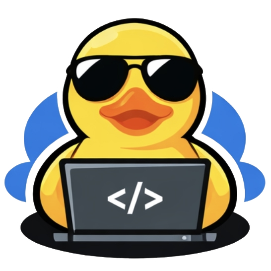

# DevDuck

<div align="center">
  
</div>

KrYa!

Devduck is rubber duck debugging — automated.
Explain the problem, and the duck will write code, close tickets, and ship changes.

## Quick Start

Install and setup everything:

```bash
node install.js
```

Or use `/install` command in Cursor IDE.

The installation script will:
- Set up environment variables
- Check and install required tools
- Configure MCP servers
- Verify everything works

## Commands

### `/install` — Setup Environment

Check and configure your development environment:

```bash
/install
# or
node install.js
```

Sets up environment variables, checks installed tools, configures MCP servers, and verifies everything works.

### `/commit` — Smart Commits

Get AI-generated commit messages based on your changes:

```bash
/commit
# or
node scripts/commit.js
```

The AI analyzes your changes and suggests an informative commit message with warnings about potential issues (sensitive files, debug code, config changes, etc.).

**Example workflow:**
```
/commit
→ AI analyzes changes
→ Suggests commit message
→ Shows warnings (if any)
→ Asks for approval
→ Commits and optionally pushes
```

### `/pr` — Pull Requests

Create or update PRs with auto-generated descriptions:

```bash
/pr
# or
node scripts/pr.js
```

The script handles the full PR workflow:
- Checks for uncommitted changes (suggests `/commit` first)
- Pushes unpushed commits
- Generates PR description from plan
- Creates PR or updates existing one

**Example workflow:**
```
/pr
→ Checks for uncommitted changes
→ If found, suggests /commit first
→ Generates PR plan file
→ Opens plan for review
→ After approval: pushes commits and creates/updates PR
```

## External Module Repositories

DevDuck supports loading modules from external repositories:

```bash
node install.js --repos git@github.com:user/repo.git,github.com/user/repo2
```

Supported URL formats:
- Git repositories: `git@github.com:user/repo.git`, `github.com/user/repo`
- Arcadia repositories: `arc://path/to/folder`

Modules from external repositories must include `manifest.json` (or `devduck.manifest.json`) with `devduckVersion` matching the main repository version.

## Troubleshooting

If something goes wrong remove the `.cache` directory and re-run `node install.js`
Or type `/troubleshoot` command in AI chat
