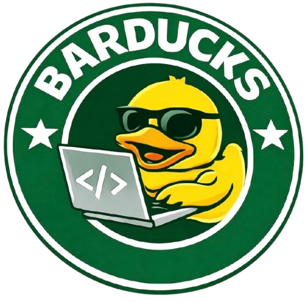

# BarDucks

[](https://github.com/holiber/barducks/actions/workflows/after-merge-ci.yml?query=branch%3Amain)
[](https://holiber.github.io/barducks/metrics/)

<div align="center">
  
</div>

KrYa!

Barducks is rubber duck debugging — automated.
Explain the problem, and the duck will write code, close tickets, and ship changes.

## Documentation

- **Workspace & extensions**: `docs/workspace-and-extensions.md`
- **Architecture (EN)**: `docs/ARCHITECTURE.md`

## Quick Start

### Create a new workspace (npx)

```bash
npx --yes github:<owner>/<repo> new ./my-barducks-workspace
```

This will:
- create `./my-barducks-workspace/workspace.config.yml`
- clone Barducks into `./my-barducks-workspace/barducks/src` (unless Barducks is already listed in `projects[]`)

### Create a new workspace from an existing `workspace.config.yml`

If you already have a `workspace.config.yml` (for example, checked into another repo or shared in your team), you can use it as a template:

```bash
npx --yes github:<owner>/<repo> new ./my-barducks-workspace --workspace-config /path/to/workspace.config.yml
```

Barducks will merge your template on top of the defaults and write the result to `./my-barducks-workspace/workspace.config.yml`.

Your workspace can reference local projects too, for example:

```json
{
  "projects": [{ "src": "./my-app" }]
}
```

Then open the workspace in Cursor and run:

```bash
node install.js --workspace-path ./my-barducks-workspace
```

Or use `/install` command in Cursor IDE.

### Install and setup everything (inside an existing workspace)

```bash
node install.js
```

The installation script will:
- Set up environment variables
- Check and install required tools
- Configure MCP servers
- Verify everything works

### Taskfile-based installation (optional)

If you prefer a declarative Taskfile workflow (CursorCloud-friendly):

```bash
# Generate Taskfile runtime from workspace config
tsx ./barducks/src/scripts/barducks-cli.ts sync

# Run installation via go-task
npx --yes -p @go-task/cli task install
```

## Commands

### `/install` — Setup Environment

Check and configure your development environment:

```bash
/install
# or
node install.js
```

Sets up environment variables, checks installed tools, configures MCP servers, and verifies everything works.

### `/commit` — Smart Commits

Get AI-generated commit messages based on your changes:

```bash
/commit
# or
node scripts/commit.js
```

The AI analyzes your changes and suggests an informative commit message with warnings about potential issues (sensitive files, debug code, config changes, etc.).

**Example workflow:**
```
/commit
→ AI analyzes changes
→ Suggests commit message
→ Shows warnings (if any)
→ Asks for approval
→ Commits and optionally pushes
```

### `/pr` — Pull Requests

Create or update PRs with auto-generated descriptions:

```bash
/pr
js
```
Prepeare/create PR based on your CONTRIBUTION.md

The script handles the full PR workflow:
- Checks for uncommitted changes (suggests `/commit` first)
- Pushes unpushed commits
- Generates PR description from plan
- Creates PR or updates existing one


## External Extension Repositories

Barducks supports loading extensions from external repositories:

```bash
node install.js --repos git@github.com:user/repo.git,github.com/user/repo2
```

Supported URL formats:
- Git repositories: `git@github.com:user/repo.git`, `github.com/user/repo`
- Arcadia repositories: `arc://path/to/folder`

Modules from external repositories must include `manifest.json` (or `devduck.manifest.json`) with `devduckVersion` matching the main repository version.

## Troubleshooting

If something goes wrong remove the `.cache` directory and re-run `node install.js`
Or type `/troubleshoot` command in AI chat

## License

Barducks is licensed under the Apache License 2.0.
See the LICENSE and NOTICE files for details.
